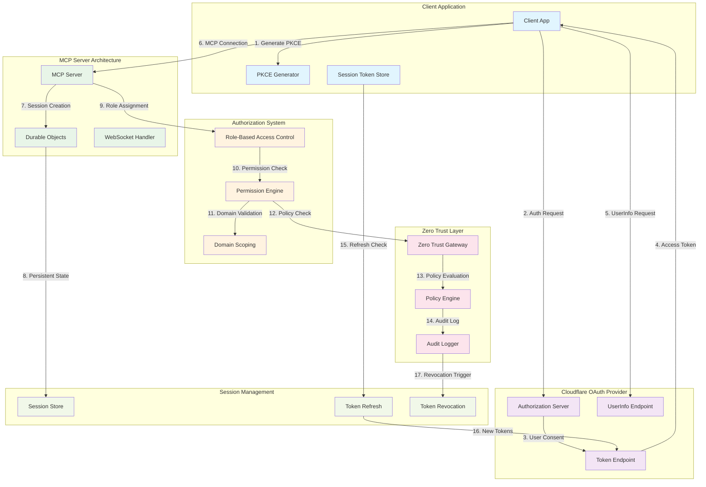
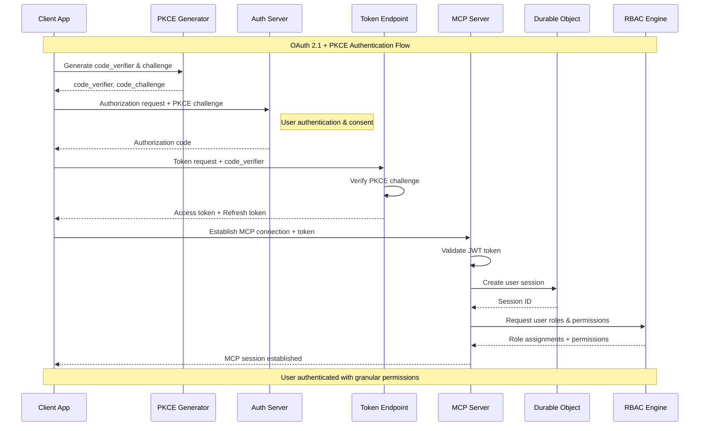
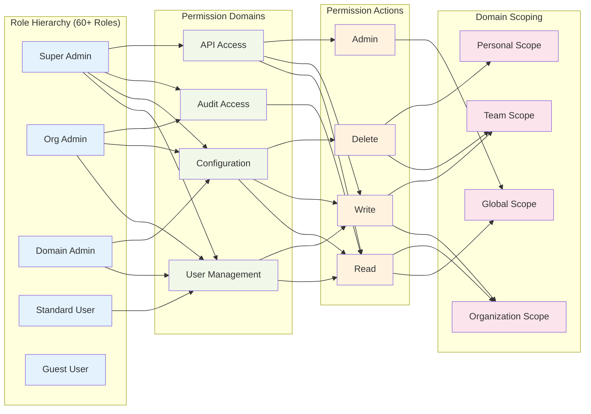
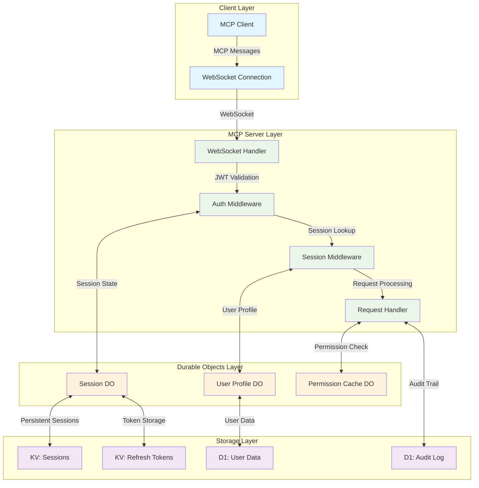
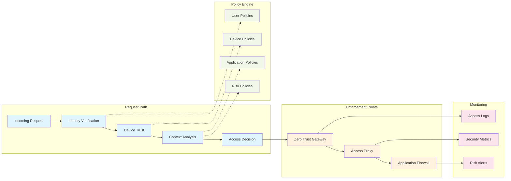

# User Accounts Architecture Diagram

## System Overview
Complete architecture diagram showing the integration between OAuth 2.1/PKCE authentication, granular authorization, MCP server architecture, and Zero Trust security.

## High-Level Architecture

## Detailed Authentication Flow

## Permission System Architecture

## MCP Server Session Management

## Zero Trust Security Integration

## Security Checkpoints

### Authentication Security
1. **PKCE Implementation**: Code verifier generation and challenge validation
2. **JWT Validation**: Signature, expiration, issuer, and audience verification
3. **Token Refresh**: Secure rotation with refresh token binding
4. **Session Security**: HttpOnly, Secure, SameSite cookie attributes

### Authorization Security
5. **Fail-Closed Defaults**: Default-deny permission model
6. **Principle of Least Privilege**: Minimal required permissions
7. **Domain Scoping**: Granular access control within organizational boundaries
8. **Role Validation**: Dynamic role assignment and verification

### MCP Security
9. **Connection Authentication**: JWT-based MCP connection establishment
10. **Message Integrity**: Request/response validation and signing
11. **Session Isolation**: Durable Objects ensure session separation
12. **Resource Protection**: Fine-grained resource access control

### Zero Trust Security
13. **Continuous Verification**: Ongoing identity and device validation
14. **Context-Aware Access**: Risk-based access decisions
15. **Encrypted Communication**: End-to-end encryption for all traffic
16. **Audit Compliance**: Comprehensive logging and monitoring

## Performance Considerations

### Token Management
- **Access Token Lifetime**: 15-minute expiration for security
- **Refresh Token Rotation**: New refresh token with each use
- **Token Caching**: In-memory caching with automatic invalidation
- **Batch Validation**: Efficient bulk token verification

### Session Performance
- **Durable Objects**: Global distribution for low-latency access
- **Session Persistence**: Automatic state restoration across connections
- **Permission Caching**: Role-based permission caching strategies
- **Connection Pooling**: Efficient WebSocket connection management

### Scalability Patterns
- **Horizontal Scaling**: Stateless authentication for infinite scale
- **Global Distribution**: Edge-based authentication processing
- **Load Balancing**: Intelligent request distribution
- **Auto-scaling**: Dynamic capacity adjustment based on demand

## Implementation Roadmap

### Phase 1: Core Authentication
1. OAuth 2.1/PKCE implementation
2. Cloudflare OAuth Provider integration
3. Basic JWT validation
4. Session establishment

### Phase 2: Authorization System
1. Role hierarchy definition
2. Permission engine implementation
3. Domain scoping configuration
4. Fail-closed security patterns

### Phase 3: MCP Integration
1. Durable Objects session management
2. WebSocket authentication
3. Real-time permission updates
4. Connection lifecycle management

### Phase 4: Zero Trust Enhancement
1. Policy engine integration
2. Continuous verification
3. Risk-based access control
4. Advanced monitoring and alerting